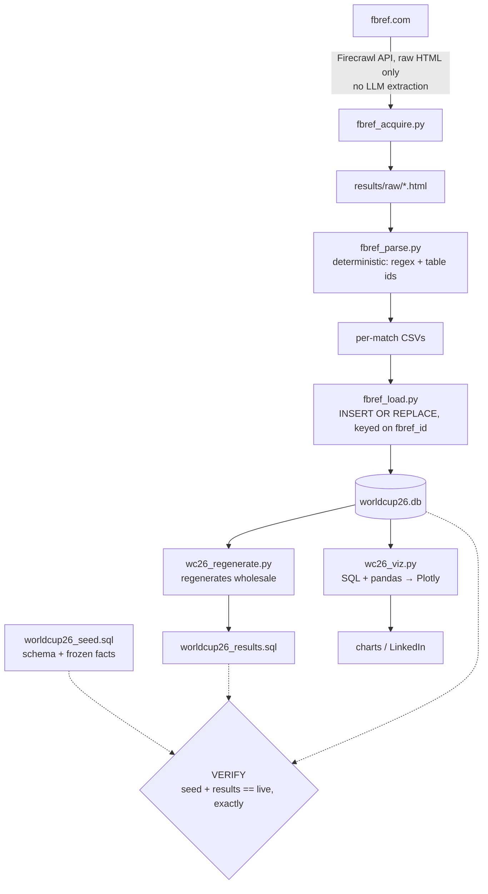

# world-cup-2026

A live, self-verifying SQLite database of the **2026 FIFA World Cup** — grown match by match
from [FBref](https://fbref.com/), rebuilt deterministically from source, and fed into Python +
Plotly for data-visualization storytelling.

**Status:** complete tournament recorded — **104 / 104 matches**, schema `v1.1.0`.
**Champions:** Spain (1–0 vs Argentina, AET).

---

## Why this exists

A real dataset, grown daily under real constraints, as a data-engineering + visualization
project. Every design decision — a frozen seed, a generated results file, an automatic rebuild
check — exists to keep the data trustworthy as it grows, not just correct once.

## Pipeline

FBref is the single source of truth. Match pages are fetched as raw HTML (via the Firecrawl API),
parsed deterministically, loaded idempotently, and the whole database is provably reconstructable
from two SQL files.



`wc26_update.py` orchestrates ACQUIRE → PARSE → LOAD → REGENERATE → VERIFY as a single command
(`/update-results <fbref-match-url ...>`). ACQUIRE/PARSE/LOAD run incrementally on new matches;
REGENERATE and VERIFY always run in full against the complete live database.

## Data model

Six tables — `teams`, `players`, `matches`, `player_stats`, `goalkeeper_stats`, `metadata`.
Stats join to players via the stable `fbref_id` key and to matches via `fbref_match_id`.
**The full schema, column definitions, and operating rules live in [`CLAUDE.md`](./CLAUDE.md)** —
this README stays a map, not a mirror.

## The guarantees (VERIFY)

The database is only trusted when a fresh scratch build from `seed + results` reproduces the live
DB exactly. On every update, VERIFY asserts:

- **Rebuild equality** — `worldcup26_seed.sql` + `worldcup26_results.sql` reconstruct the live DB byte-for-byte.
- **Goals reconcile** — for each played match, Σ player goals = the scoreline (allowing for own goals).
- **Team membership** — every stat row belongs to a player on one of that match's two squads
  (catches attribution errors that conserved-sum checks miss).
- **Monotonic floors** — match/stat counts never regress across loads.

Any mismatch is a loud failure, investigated before the file is trusted.

## Layout

```
worldcup26_seed.sql       schema + frozen reference data
worldcup26_results.sql    generated artifact — never hand-edited
worldcup26.db             the live database
fbref_acquire.py          ACQUIRE — raw HTML via Firecrawl API
fbref_parse.py            PARSE — deterministic HTML → CSV
fbref_load.py             LOAD — CSV → DB, idempotent
wc26_regenerate.py        REGENERATE — DB → results.sql
wc26_verify.py            VERIFY — rebuild + invariant checks
wc26_update.py            orchestrator (/update-results)
wc26_viz.py               Plotly visualizations
results/                  per-match CSVs (tracked); raw HTML + chart output (generated, gitignored)
```

## Quickstart

```bash
# Rebuild the DB from source-controlled SQL (deterministic)
sqlite3 worldcup26.db < worldcup26_seed.sql
sqlite3 worldcup26.db < worldcup26_results.sql

# Add / refresh a match end to end
python wc26_update.py <fbref-match-url>        # ACQUIRE→PARSE→LOAD→REGENERATE→VERIFY

# Render charts
pip install plotly kaleido --break-system-packages
python wc26_viz.py
```

## For AI contributors

- **The database is canonical.** FBref match data is the source of truth; when in doubt, query reality.
- **`worldcup26_results.sql` is generated, never hand-edited** — change data, then let REGENERATE rewrite it.
- **The rebuild check must pass.** A green VERIFY (seed + results == live) is the bar for any change.
- **Join on the stable keys** — `fbref_id` (players), `fbref_match_id` (matches) — never raw integer ids,
  which can shift when tables are renumbered.
- **Parsing is deterministic** (regex + table ids), **no LLM extraction** — raw HTML in, exact rows out.

## Data source

All match data from [FBref](https://fbref.com/) (Sports Reference). This is a personal
data-engineering project and is not affiliated with FIFA, FBref, or any federation.
