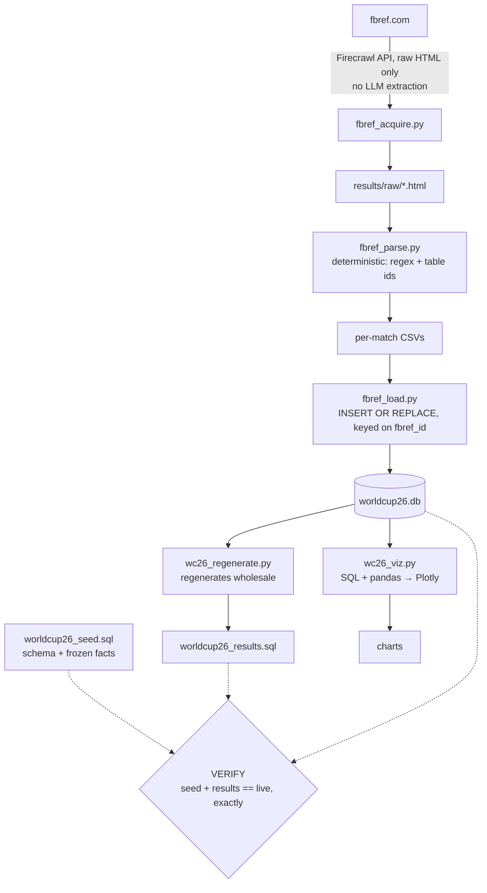

# World Cup 2026 — FBref → SQLite data pipeline

A deterministic ETL pipeline and relational database covering all **104 matches** of the
FIFA World Cup 2026 (11 Jun – 19 Jul 2026): squads, results, and per-player and
per-goalkeeper match statistics, sourced from [FBref](https://fbref.com/en/) and
rebuildable from source SQL at any time.

**Status:** tournament complete. Database static at 104/104 matches with stats — 3,283
player-match rows, 215 goalkeeper rows, 1,037 players with minutes. Schema `v1.1.0`.

## Why it exists

The interesting problem in a data project is never the domain — it's the architecture.
Chaotic source in, validated and analysis-ready data out, no manual steps in between.
Football was the substrate; the pipeline is the point.

## Architecture



`wc26_update.py` orchestrates ACQUIRE → PARSE → LOAD → REGENERATE → VERIFY as one command.
It writes nothing to the data tables itself — its only own write is three `metadata` fields
immediately before REGENERATE.

**The database is written first; `worldcup26_results.sql` is derived from it.** Sequential,
not sibling outputs. That direction is the pipeline's central rule.

Schema is seven tables — `teams` → `players` → `player_stats` / `goalkeeper_stats`, with
`matches` joining both stat tables and holding FKs to `teams` (home/away) and `stadiums`;
`metadata` is an unconnected singleton. Column-level truth lives in
[`CLAUDE.md`](CLAUDE.md); this file doesn't copy it.

## Repository structure

```
world-cup-2026/
├── README.md               # what this is, how to run it
├── CLAUDE.md               # schema truth + operating rules for AI contributors
├── fbref_acquire.py        # ACQUIRE — Firecrawl API, raw HTML only
├── fbref_parse.py          # PARSE   — deterministic regex + table ids
├── fbref_load.py           # LOAD    — INSERT OR REPLACE keyed on fbref_id
├── wc26_regenerate.py      # REGEN   — writes worldcup26_results.sql wholesale
├── wc26_verify.py          # VERIFY  — four invariant checks
├── wc26_update.py          # orchestrator for the five stages above
├── wc26_viz.py             # SQL + pandas → Plotly
├── worldcup26_seed.sql     # schema + frozen facts — hand-authored
├── worldcup26_results.sql  # GENERATED — never hand-edited
├── worldcup26.db           # the database (tracked deliberately)
└── results/                # per-match player/keeper stat CSVs
    └── raw/                # cached FBref HTML (gitignored)
```

## Quick start

```bash
# Rebuild the database from source-controlled SQL
sqlite3 worldcup26.db < worldcup26_seed.sql
sqlite3 worldcup26.db < worldcup26_results.sql

# Confirm the rebuild is faithful
python3 wc26_verify.py

# Generate the charts
python3 wc26_viz.py
```

Chart output is gitignored and regenerated on demand. Ingesting a new match needs a
Firecrawl API key in a gitignored `.env` and runs through the orchestrator.

## Verification

`wc26_verify.py` runs four checks; all four must pass.

| Check | What it proves |
|---|---|
| **Rebuild equality** | seed + results reconstruct the live database exactly |
| **Goals reconcile** | Σ attributed goals equals the scoreline, allowing own goals |
| **Team membership** | every stat row belongs to a player on one of that match's two squads |
| **Row counts** | counts equal their known final values, in either direction |

Team membership exists because of a real defect: renumbering `players` left the stat tables
pointing at the wrong people while every per-match sum stayed conserved. A goalkeeper led
the scoring chart and nothing flagged it. **Conserved totals cannot catch a permutation.**

These prove internal consistency. They do not prove the database agrees with FBref.

## AI Contributor Guide

- Read this file before changing code; don't violate the invariants below.
- If uncertain, state your assumptions — never silently change behaviour.
- Generated files stay generated. Regenerate; don't hand-edit.
- Deterministic beats clever.

**Invariants:**

1. **`worldcup26.db` is canonical.** Everything else is derived from it.
2. **The parser is deterministic** — regex and table ids only, no LLM extraction anywhere
   in acquisition or parsing.
3. **`worldcup26_results.sql` is generated**, rewritten wholesale by `wc26_regenerate.py`.
4. **The rebuild check must pass.** A change that breaks it isn't finished.
