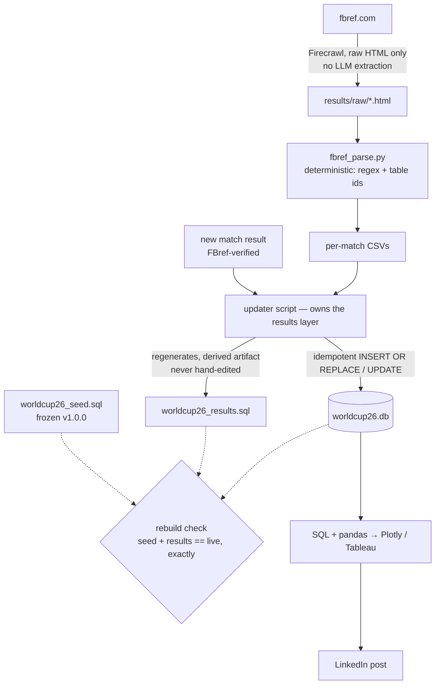

_**Pipeline current map:**_

**Node 1 — `FB[fbref.com] → RAW[results/raw/*.html]`, via Firecrawl, raw HTML only, no LLM extraction.**

**Node 2 — `RAW → PARSE[fbref_parse.py] → CSV[per-match CSVs]`.** This step _doesn't change_ — `fbref_parse.py`'s deterministic regex/table-id logic stays as-is.

**Node 3 — `NEW[new match result, FBref-verified] → UPD`.** A second, separate input: verified scores/corners/possession/attendance/referee data, feeding the updater directly (not through the HTML/parse path — this is the "new played match" flow, distinct from the stats backfill flow).

**Node 4 — `CSV → UPD[updater script — owns the results layer]`.** This is the core new build. `UPD` doesn't exist yet — it replaces the whole June improvisation (`generate_inserts.py`, the manual batch loop, the never-built `/load-match`). One script owns both the "regenerate everything" and "apply one new match" paths.

**Node 5 — `UPD → RES[worldcup26_results.sql]`, regenerated, never hand-edited.** Output contract: `results.sql` becomes a pure derived artifact from here on — the script always regenerates it from data, never a manual edit again.

**Node 6 — `UPD → DB[(worldcup26.db)]`, idempotent `INSERT OR REPLACE` / `UPDATE`.** Same script applies to the live DB, idempotently — re-running never double-inserts or corrupts state.

**Node 7 — the dotted lines into `CHECK{rebuild check: seed + results == live, exactly}`.** Dotted = verification, not data flow. This has to run _automatically inside the script_, not as a separate manual step afterward — that's explicit in the paper spec (§1.3).

**Node 8 — `DB → VIZ → LI[LinkedIn post]`.** Downstream, out of scope for S7a itself (that's S7b's first chart + the post) — shown for context on where this ultimately points.

**Expected output of the Claude Code CLI session**, per the Definition of Done: a working `UPD` script wired as a new slash command (`/update-results <source>`, replacing the `/load-match` ambition), Firecrawl now doing the raw-HTML fetch in place of Chrome, `results.sql` regenerating clean from the pre-session CSV export, the rebuild check running inside the script, and one incremental match applied+verified. The diagram itself doesn't get touched today — that's the separate "S7 verify pipeline diagram" task already sitting on your board for after the build ships, to diff this planned version against what actually got built.

_**Spec prompt for Claude Code**_

S7a Paper Spec — Dynamic Results Updater

Scope: S7a only. The 28 played matches missing stats are S7b backfill —
out of scope for this build. No schema changes (freeze holds until Jul 19).

1. Inputs: live worldcup26.db state (not a fresh CSV export each run — the
   §0 export was only this session's baseline snapshot for verification).
   Baseline as of 2026-07-13: player_stats 2,263 / goalkeeper_stats 149 /
   matches 104 (100 played, 72 with stats loaded).
2. Output contract: worldcup26_results.sql is regenerated wholesale from
   live DB state every run — never hand-edited, never blind-appended.
   Idempotent: running it twice produces an identical file.
3. Pipeline shape: ACQUIRE/PARSE/LOAD are incremental (only new matches);
   REGENERATE + VERIFY always run full, from complete live DB state.
4. Architecture — one script per node, reuse what already works:
   - ACQUIRE (new): Python script calling the Firecrawl API directly
     (API key via env var — NOT an MCP tool; scripts can't call MCP).
     Rendered HTML fetch with the params proven in wc26-daily-update
     (formats: ["html"], proxy: "auto", waitFor) → results/raw/{hex}.html.
     Replaces the dead Chrome/fbref_move.py step. No LLM extraction —
     raw HTML only.
   - PARSE (unchanged): fbref_parse.py, as-is. Firecrawl's rendered fetch
     already resolves FBref's comment-wrapped stat tables — no seam work.
   - LOAD (unchanged): fbref_load.py, as-is. INSERT OR REPLACE into
     player_stats/goalkeeper_stats, keyed on fbref_id/fbref_match_id.
   - REGENERATE (new, replaces generate_inserts.py): reads live DB —
     UPDATE matches for every played match, INSERT OR IGNORE for every
     player_stats/goalkeeper_stats row — writes the complete
     worldcup26_results.sql from scratch each run. Fixes the current
     append-only non-idempotency bug. Archive generate_inserts.py once
     this replaces it — don't leave two generators.
   - VERIFY (new): rebuild check runs automatically inside the same
     flow — fresh scratch DB from seed+results, row counts diffed
     against live (and against the baseline above). Loud failure on
     mismatch. Not a manual afterthought.
   - ORCHESTRATOR: extends fbref_batch.py's existing pending-match
     detection (HTML on disk, no player_stats rows yet) to call ACQUIRE
     first and REGENERATE + VERIFY after, instead of stopping at LOAD.
     Wired as a new slash command: /update-results <source>, where
     <source> is one or more FBref match URLs (space-separated).
5. Name→id resolution: unchanged — players.fbref_id, matches.fbref_match_id
   crosswalks already live from S6. Miss policy: skip + log, never
   silent-insert.
6. Failure behavior: any node failure (scrape error, parse miss, unresolved
   id) skips that match and logs it — never partial-applies, never
   estimates. Rebuild-check mismatch = loud failure, investigate before
   trusting the file.

_**Claude Code Plan Mode Output**_

Good spec — the scope discipline (S7b explicitly carved out), the incremental-vs-full split, no-LLM-extraction, and the skip+log miss policy all line up with the pipeline rules. Reviewing it as a paper spec (not building anything), here's what I'd want resolved before you write a line, ranked by blast radius.

Blocking

1. REGENERATE will silently drop knockout team assignments. §4 says REGENERATE emits "UPDATE matches for every played match." But worldcup26_results.sql also carries the pre-match bracket resolutions — UPDATE matches SET team_home=…, team_away=… for knockout slots that are resolved but not yet played (S7's QF bracket work, commit ae0b7a1). If the regenerator only walks played matches, those assignments vanish from the file. Next seed → results rebuild → NULL team_home/team_away for every upcoming knockout match. The selection rule can't be "played"; it has to be "any match whose live row differs from the seed placeholder" (teams resolved or score present).

**Item 1 — why it's blocking.** Your results file isn't just "scores of finished games." It also carries the bracket answers: "the winner of Group A plays in match 89," resolved into actual team names once groups finish. Those live in the same `matches` table, but for games that _haven't been played yet_. If your regenerator only writes out played matches, it silently throws those bracket answers away every time it rebuilds the file. Everything looks fine — until you rebuild the database from seed + results and every upcoming knockout match has blank teams. It's blocking because it's silent data loss: no error, no crash, you'd only notice when the bracket goes empty. The question it forces: what's the real rule for "which rows belong in this file?" — and "played" turns out to be the wrong rule.

2. "PARSE unchanged — no seam work" is asserted, not proven. This is the single riskiest claim in the spec and it's the exact thing that killed the old path. FBref wraps the stats_*_summary / keeper_stats_* tables in HTML comments; the Chrome-saved HTML worked because the browser ran the JS that un-comments them. Whether Firecrawl's formats:["html"] + waitFor returns the post-JS rendered DOM (real tables) or the raw source (still comment-wrapped) decides whether fbref_parse.py finds anything at all. Don't promote PARSE to "unchanged" on faith — the spec should require a one-match proof spike (fetch → parse → non-empty CSV) as the gate before the rest of the build is even valid.

**Item 2 — why it's blocking.** FBref hides its stat tables inside HTML comments — think of them as written in invisible ink that only becomes visible when a browser runs the page's JavaScript. Your old Chrome workflow worked because Chrome ran that JavaScript. The spec _assumes_ Firecrawl does the same, based on a note from a different task that fetched match pages — but nobody has actually confirmed it makes _these specific tables_ visible. If the assumption is wrong, your parser finds nothing, and every downstream piece you built is sitting on sand. That's why the review says: prove it with one match before building anything. Blocking = "if this is false, the whole plan is invalid," so test it first for the cost of one fetch.

Should fix

3. Metadata is unaddressed. If results.sql is regenerated wholesale, the UPDATE metadata SET last_sync/last_matchday/records_imported line has to be regenerated too or the rebuild loses it. And records_imported is defined as a this-run delta — in a wholesale-regen world its meaning is ambiguous. Decide what it holds and state it.

4. VERIFY's baseline is a floor, not an equality target. Diffing the scratch rebuild against live = correct (must be exact). Diffing against the frozen 2,263 / 149 / 104 baseline = wrong the instant the first new match loads. Treat the baseline as a one-time snapshot / monotonic floor (counts never decrease), and make the equality assertion live-vs-scratch only.

5. Byte-identical idempotency needs deterministic ordering. §2's "run it twice → identical file" only holds if every emitted statement has a stable ORDER BY (match_id, then player_id, etc.). Worth stating explicitly so it's not left to whatever order the SELECT happens to return.

**Items 3–5 — what to think about.** These won't invalidate the architecture, but each is an undefined behavior that will bite later if left vague. Item 3: there's a bookkeeping line in the file (last sync date, how many records imported) — if you regenerate the file from scratch each time, what should that line say now? "Records imported _this run_" stops making sense when every run rewrites everything. You need to pick a meaning. Item 4: your check compares two things to make sure they match. Comparing the rebuilt database against the _live_ one must be exact. But comparing against the July 13 snapshot numbers only works today — the moment new matches load, those numbers are stale. So the snapshot can only serve as a "counts should never go _below_ this" sanity check, not an equality test. Item 5: you promised running the script twice gives an _identical_ file. Databases don't guarantee the order rows come back in unless you ask — so without an explicit sort, two runs could emit the same rows shuffled differently, and your "identical file" promise breaks for a dumb reason. One line of sorting fixes it, but the spec should say so.

Minor

6. Define match-level atomicity. "Never partial-applies" is clear at the match level but LOAD is INSERT OR REPLACE per player row. If a fetch yields one team's table but not the other, is that a partial success or a loud failure? Given the parser is supposed to find both teams, I'd make "only one summary table found" a match failure, not a half-load.

7. Pre-empt a requests misread. ACQUIRE will use requests against api.firecrawl.dev, which looks like it violates the "never requests/curl/httpx" rule — but that rule is specifically about hitting FBref directly (403s). Firecrawl does the FBref fetch; the script only talks to Firecrawl's API. Worth a one-line note in the spec so a future reader (or a review pass) doesn't flag it as a violation.

**Items 6–7 — worth thinking about, briefly.** Item 6 is a real edge case: if a page gives you one team's stats but not the other's, do you load half a match or reject the whole thing? Worth one sentence of policy, five minutes of thought. Item 7 isn't even a problem — it's a pre-emptive footnote so a future reviewer doesn't mistake "script talks to Firecrawl's API" for "script scrapes FBref directly," which your rules forbid. Decide it in the plan session and move on; neither deserves real worry.